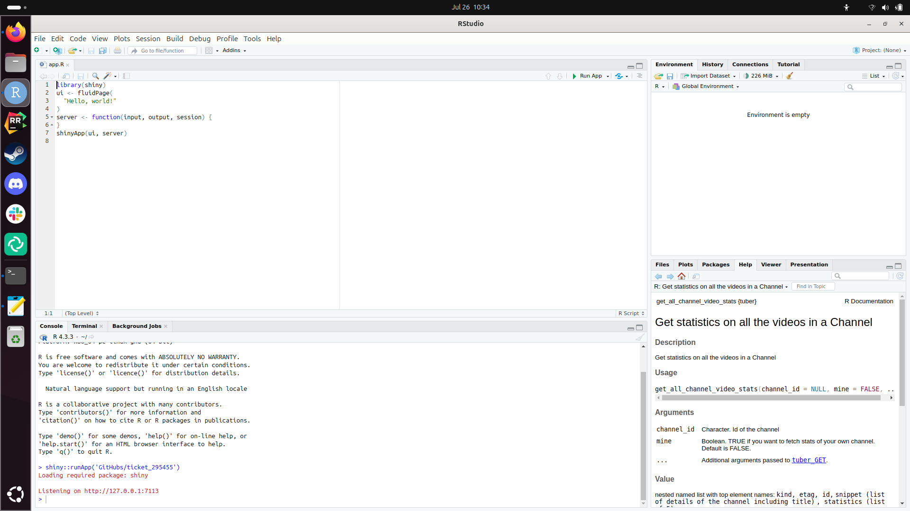
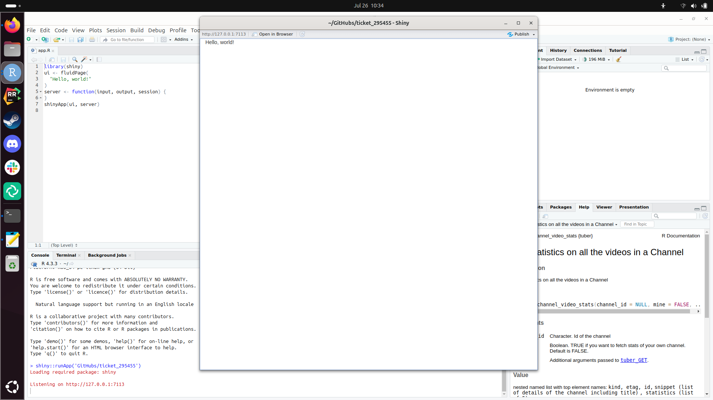

# ticket_295455

Ticket 295455


From [https://mastering-shiny.org/basic-app.html](https://mastering-shiny.org/basic-app.html)
created

```r
library(shiny)
ui <- fluidPage(
  "Hello, world!"
)
server <- function(input, output, session) {
}
shinyApp(ui, server)
```

and put this in [app.R](app.R)

## Local computer

Testing this on a local Ubuntu 24.04 Nimble computer:





Works!

## Rackham from website

Following the doc at [https://docs.uppmax.uu.se/getting_started/login_rackham_remote_desktop_website/](https://docs.uppmax.uu.se/getting_started/login_rackham_remote_desktop_website/),
browse to [https://rackham-gui.uppmax.uu.se/](https://rackham-gui.uppmax.uu.se/).

Starting an interactive node, from the doc at [https://docs.uppmax.uu.se/cluster_guides/start_interactive_node_on_rackham/](https://docs.uppmax.uu.se/cluster_guides/start_interactive_node_on_rackham/):

```bash
interactive -A staff
```

Then, from [https://docs.uppmax.uu.se/cluster_guides/rstudio_on_rackham/](https://docs.uppmax.uu.se/cluster_guides/rstudio_on_rackham/):

```bash
module load RStudio/2023.06.2-561
```

Gives the new RStudio error:

```
[richel@r486 richel]$ module load RStudio/2023.06.2-561
RStudio/2023.06.2-561: Sandboxing is not enabled for RStudio at UPPMAX. See 'module help RStudio/2023.06.2-561' for more information
```

Doing that:


```
[richel@r486 richel]$ module help RStudio/2023.06.2-561

------------------------------------------------------------------- Module Specific Help for "RStudio/2023.06.2-561" -------------------------------------------------------------------
	RStudio - use RStudio 2023.06.2-561

	Version 2023.06.2-561

With the Linux distribution used on most UPPMAX clusters (CentOS 7), RStudio/2023.06.2-561
prefers to use a 'suid sandbox'. We do not enable this at UPPMAX. Instead, we disable sandboxing
during startup of RStudio by defining a shell alias for the 'rstudio' command. You may notice
additional errors in the terminal window from which you ran the 'rstudio' command. This is
expected and does not affect RStudio operation.

For performance reasons, UPPMAX disables checks for updates.

UPPMAX also disables the 'Packages' pane of RStudio if an R_packages module is loaded.
```

So, starting with:

```bash
rstudio
```
