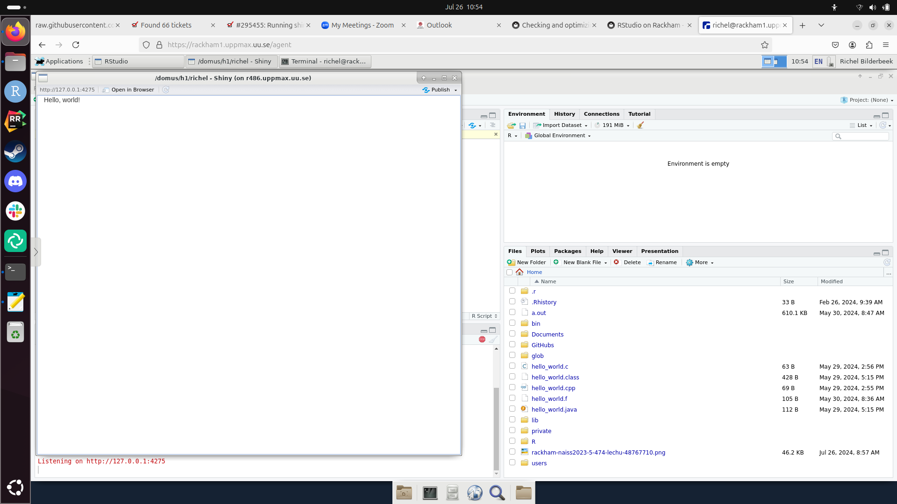

# ticket_295455


## Problem

Cannot run Shiny app on Rackham.

Error:

```text
Warning: Error in Cairo: X11 fatal IO error: please save work and shut down R
```

Full error log:

```
(firefox:9429): dconf-CRITICAL **: 00:53:25.200: unable to create directory '/run/user/4014270/dconf': Permission denied. dconf will not work properly.
[Parent 9429, Main Thread] WARNING: unable to create directory '/run/user/4014270/dconf': Permission denied. dconf will not work properly.: 'glib warning', file /builddir/build/BUILD/firefox-115.11.0/toolkit/xre/nsSigHandlers.cpp:167

(firefox:9429): dconf-CRITICAL **: 00:53:25.200: unable to create directory '/run/user/4014270/dconf': Permission denied. dconf will not work properly.
[Parent 9429, Main Thread] WARNING: unable to create directory '/run/user/4014270/dconf': Permission denied. dconf will not work properly.: 'glib warning', file /builddir/build/BUILD/firefox-115.11.0/toolkit/xre/nsSigHandlers.cpp:167

(firefox:9429): dconf-CRITICAL **: 00:53:25.201: unable to create directory '/run/user/4014270/dconf': Permission denied. dconf will not work properly.
[Parent 9429, Main Thread] WARNING: unable to create directory '/run/user/4014270/dconf': Permission denied. dconf will not work properly.: 'glib warning', file /builddir/build/BUILD/firefox-115.11.0/toolkit/xre/nsSigHandlers.cpp:167

(firefox:9429): dconf-CRITICAL **: 00:53:25.201: unable to create directory '/run/user/4014270/dconf': Permission denied. dconf will not work properly.
[Parent 9429, Main Thread] WARNING: unable to create directory '/run/user/4014270/dconf': Permission denied. dconf will not work properly.: 'glib warning', file /builddir/build/BUILD/firefox-115.11.0/toolkit/xre/nsSigHandlers.cpp:167

(firefox:9429): dconf-CRITICAL **: 00:53:25.214: unable to create directory '/run/user/4014270/dconf': Permission denied. dconf will not work properly.
[Parent 9429, Main Thread] WARNING: unable to create directory '/run/user/4014270/dconf': Permission denied. dconf will not work properly.: 'glib warning', file /builddir/build/BUILD/firefox-115.11.0/toolkit/xre/nsSigHandlers.cpp:167

(firefox:9429): dconf-CRITICAL **: 00:53:25.215: unable to create directory '/run/user/4014270/dconf': Permission denied. dconf will not work properly.
[Parent 9429, Main Thread] WARNING: unable to create directory '/run/user/4014270/dconf': Permission denied. dconf will not work properly.: 'glib warning', file /builddir/build/BUILD/firefox-115.11.0/toolkit/xre/nsSigHandlers.cpp:167

(firefox:9429): dconf-CRITICAL **: 00:53:25.215: unable to create directory '/run/user/4014270/dconf': Permission denied. dconf will not work properly.
[Parent 9429, Main Thread] WARNING: unable to create directory '/run/user/4014270/dconf': Permission denied. dconf will not work properly.: 'glib warning', file /builddir/build/BUILD/firefox-115.11.0/toolkit/xre/nsSigHandlers.cpp:167

(firefox:9429): dconf-CRITICAL **: 00:53:25.216: unable to create directory '/run/user/4014270/dconf': Permission denied. dconf will not work properly.
[Parent 9429, Main Thread] WARNING: unable to create directory '/run/user/4014270/dconf': Permission denied. dconf will not work properly.: 'glib warning', file /builddir/build/BUILD/firefox-115.11.0/toolkit/xre/nsSigHandlers.cpp:167

(firefox:9429): dconf-CRITICAL **: 00:53:25.217: unable to create directory '/run/user/4014270/dconf': Permission denied. dconf will not work properly.
[Parent 9429, Main Thread] WARNING: unable to create directory '/run/user/4014270/dconf': Permission denied. dconf will not work properly.: 'glib warning', file /builddir/build/BUILD/firefox-115.11.0/toolkit/xre/nsSigHandlers.cpp:167

(firefox:9429): dconf-CRITICAL **: 00:53:25.217: unable to create directory '/run/user/4014270/dconf': Permission denied. dconf will not work properly.
[Parent 9429, Main Thread] WARNING: unable to create directory '/run/user/4014270/dconf': Permission denied. dconf will not work properly.: 'glib warning', file /builddir/build/BUILD/firefox-115.11.0/toolkit/xre/nsSigHandlers.cpp:167

(firefox:9429): dconf-CRITICAL **: 00:53:25.218: unable to create directory '/run/user/4014270/dconf': Permission denied. dconf will not work properly.
[Parent 9429, Main Thread] WARNING: unable to create directory '/run/user/4014270/dconf': Permission denied. dconf will not work properly.: 'glib warning', file /builddir/build/BUILD/firefox-115.11.0/toolkit/xre/nsSigHandlers.cpp:167

(firefox:9429): dconf-CRITICAL **: 00:53:25.218: unable to create directory '/run/user/4014270/dconf': Permission denied. dconf will not work properly.
Warning: Error in Cairo: X11 fatal IO error: please save work and shut down R
132: Cairo
131: <Anonymous>
129: startPNG
128: drawPlot
114: <reactive:plotObj>
98: drawReactive
85: renderFunc
84: output$ATAC
3: shiny::runApp
2: shiny::runGadget
1: ArchRBrowser


[ERROR viaduct::backend::ffi] Missing HTTP status
[ERROR viaduct::backend::ffi] Missing HTTP status
[ERROR viaduct::backend::ffi] Missing HTTP status
```

## Reproduce error

From [https://mastering-shiny.org/basic-app.html](https://mastering-shiny.org/basic-app.html)
created

```r
library(shiny)
ui <- fluidPage(
  "Hello, world!"
)
server <- function(input, output, session) {
}
shinyApp(ui, server)
```

and put this in [app.R](app.R)

## Local computer

Testing this on a local Ubuntu 24.04 Nimble computer:


Works!

## Rackham from website

Following the doc at [https://docs.uppmax.uu.se/getting_started/login_rackham_remote_desktop_website/](https://docs.uppmax.uu.se/getting_started/login_rackham_remote_desktop_website/),
browse to [https://rackham-gui.uppmax.uu.se/](https://rackham-gui.uppmax.uu.se/).

Starting an interactive node, from the doc at [https://docs.uppmax.uu.se/cluster_guides/start_interactive_node_on_rackham/](https://docs.uppmax.uu.se/cluster_guides/start_interactive_node_on_rackham/):

```bash
interactive -A staff
```

Then, from [https://docs.uppmax.uu.se/cluster_guides/rstudio_on_rackham/](https://docs.uppmax.uu.se/cluster_guides/rstudio_on_rackham/):

```bash
module load RStudio/2023.06.2-561
```

Gives the new RStudio error:

```
[richel@r486 richel]$ module load RStudio/2023.06.2-561
RStudio/2023.06.2-561: Sandboxing is not enabled for RStudio at UPPMAX. See 'module help RStudio/2023.06.2-561' for more information
```

Doing that:


```
[richel@r486 richel]$ module help RStudio/2023.06.2-561

------------------------------------------------------------------- Module Specific Help for "RStudio/2023.06.2-561" -------------------------------------------------------------------
	RStudio - use RStudio 2023.06.2-561

	Version 2023.06.2-561

With the Linux distribution used on most UPPMAX clusters (CentOS 7), RStudio/2023.06.2-561
prefers to use a 'suid sandbox'. We do not enable this at UPPMAX. Instead, we disable sandboxing
during startup of RStudio by defining a shell alias for the 'rstudio' command. You may notice
additional errors in the terminal window from which you ran the 'rstudio' command. This is
expected and does not affect RStudio operation.

For performance reasons, UPPMAX disables checks for updates.

UPPMAX also disables the 'Packages' pane of RStudio if an R_packages module is loaded.
```

So, starting with:

```bash
rstudio
```

Then in a terminal:

```bash
wget https://raw.githubusercontent.com/uppsala-makerspace/ticket_295455/main/app.R
```

In RStdio loading the code works fine. It asks for installing the Shiny package.
I clicked 'Yes'


After about 5-10 minutes, the application starts:



The output my terminal gave was:

```text
[richel@r486 richel]$ rstudio
[18024:0726/104545.209328:ERROR:bus.cc(399)] Failed to connect to the bus: Failed to connect to socket /tmp/dbus-3OPAsJRfcJ: Connection refused
[18024:0726/104545.209673:ERROR:bus.cc(399)] Failed to connect to the bus: Failed to connect to socket /tmp/dbus-3OPAsJRfcJ: Connection refused
[18024:0726/104546.373753:ERROR:bus.cc(399)] Failed to connect to the bus: Failed to connect to socket /tmp/dbus-3OPAsJRfcJ: Connection refused
[18024:0726/104546.737316:ERROR:bus.cc(399)] Failed to connect to the bus: Failed to connect to socket /tmp/dbus-3OPAsJRfcJ: Connection refused
[18079:0726/104546.902133:ERROR:gpu_memory_buffer_support_x11.cc(49)] dri3 extension not supported.
[18024:0726/104546.946939:ERROR:bus.cc(399)] Failed to connect to the bus: Failed to connect to socket /tmp/dbus-3OPAsJRfcJ: Connection refused
[18024:0726/104552.518751:ERROR:bus.cc(399)] Failed to connect to the bus: Failed to connect to socket /tmp/dbus-3OPAsJRfcJ: Connection refused
[18024:0726/104552.623480:ERROR:bus.cc(399)] Failed to connect to the bus: Failed to connect to socket /tmp/dbus-3OPAsJRfcJ: Connection refused
[18024:0726/104552.700426:ERROR:bus.cc(399)] Failed to connect to the bus: Failed to connect to socket /tmp/dbus-3OPAsJRfcJ: Connection refused
[18024:0726/104552.798535:ERROR:bus.cc(399)] Failed to connect to the bus: Failed to connect to socket /tmp/dbus-3OPAsJRfcJ: Connection refused
[18024:0726/104552.854285:ERROR:bus.cc(399)] Failed to connect to the bus: Failed to connect to socket /tmp/dbus-3OPAsJRfcJ: Connection refused
[18024:0726/104552.973297:ERROR:bus.cc(399)] Failed to connect to the bus: Failed to connect to socket /tmp/dbus-3OPAsJRfcJ: Connection refused
[18024:0726/104553.128395:ERROR:bus.cc(399)] Failed to connect to the bus: Failed to connect to socket /tmp/dbus-3OPAsJRfcJ: Connection refused
[18024:0726/104553.283083:ERROR:bus.cc(399)] Failed to connect to the bus: Failed to connect to socket /tmp/dbus-3OPAsJRfcJ: Connection refused
[18024:0726/104553.528514:ERROR:bus.cc(399)] Failed to connect to the bus: Failed to connect to socket /tmp/dbus-3OPAsJRfcJ: Connection refused
[18024:0726/104553.620319:ERROR:bus.cc(399)] Failed to connect to the bus: Failed to connect to socket /tmp/dbus-3OPAsJRfcJ: Connection refused
[18024:0726/104557.382935:ERROR:bus.cc(399)] Failed to connect to the bus: Failed to connect to socket /tmp/dbus-3OPAsJRfcJ: Connection refused
[18079:0726/104725.557888:ERROR:x11_software_bitmap_presenter.cc(142)] XGetWindowAttributes failed for window 48234522
[18024:0726/104730.716378:ERROR:bus.cc(399)] Failed to connect to the bus: Failed to connect to socket /tmp/dbus-3OPAsJRfcJ: Connection refused
[18024:0726/104737.106778:ERROR:bus.cc(399)] Failed to connect to the bus: Failed to connect to socket /tmp/dbus-3OPAsJRfcJ: Connection refused
[18024:0726/104737.502709:ERROR:bus.cc(399)] Failed to connect to the bus: Failed to connect to socket /tmp/dbus-3OPAsJRfcJ: Connection refused
[18024:0726/104737.778362:ERROR:bus.cc(399)] Failed to connect to the bus: Failed to connect to socket /tmp/dbus-3OPAsJRfcJ: Connection refused
[18024:0726/104737.941378:ERROR:bus.cc(399)] Failed to connect to the bus: Failed to connect to socket /tmp/dbus-3OPAsJRfcJ: Connection refused
[18024:0726/104738.022613:ERROR:bus.cc(399)] Failed to connect to the bus: Failed to connect to socket /tmp/dbus-3OPAsJRfcJ: Connection refused
[18024:0726/104738.091062:ERROR:bus.cc(399)] Failed to connect to the bus: Failed to connect to socket /tmp/dbus-3OPAsJRfcJ: Connection refused
[18024:0726/104738.314841:ERROR:bus.cc(399)] Failed to connect to the bus: Failed to connect to socket /tmp/dbus-3OPAsJRfcJ: Connection refused
[18024:0726/104738.557383:ERROR:bus.cc(399)] Failed to connect to the bus: Failed to connect to socket /tmp/dbus-3OPAsJRfcJ: Connection refused
[18024:0726/104747.493216:ERROR:bus.cc(399)] Failed to connect to the bus: Failed to connect to socket /tmp/dbus-3OPAsJRfcJ: Connection refused
[18024:0726/104753.408875:ERROR:bus.cc(399)] Failed to connect to the bus: Failed to connect to socket /tmp/dbus-3OPAsJRfcJ: Connection refused
[18024:0726/105345.083508:ERROR:bus.cc(399)] Failed to connect to the bus: Failed to connect to socket /tmp/dbus-3OPAsJRfcJ: Connection refused
[18024:0726/105346.021231:ERROR:bus.cc(399)] Failed to connect to the bus: Failed to connect to socket /tmp/dbus-3OPAsJRfcJ: Connection refused
[18024:0726/105347.979216:ERROR:bus.cc(399)] Failed to connect to the bus: Failed to connect to socket /tmp/dbus-3OPAsJRfcJ: Connection refused
[18024:0726/105347.987551:ERROR:bus.cc(399)] Failed to connect to the bus: Failed to connect to socket /tmp/dbus-3OPAsJRfcJ: Connection refused
[18024:0726/105348.093490:ERROR:bus.cc(399)] Failed to connect to the bus: Failed to connect to socket /tmp/dbus-3OPAsJRfcJ: Connection refused
[18024:0726/105348.095120:ERROR:bus.cc(399)] Failed to connect to the bus: Failed to connect to socket /tmp/dbus-3OPAsJRfcJ: Connection refused
[18024:0726/105348.151288:ERROR:bus.cc(399)] Failed to connect to the bus: Failed to connect to socket /tmp/dbus-3OPAsJRfcJ: Connection refused
[18024:0726/105348.152771:ERROR:bus.cc(399)] Failed to connect to the bus: Failed to connect to socket /tmp/dbus-3OPAsJRfcJ: Connection refused
[18024:0726/105348.225266:ERROR:bus.cc(399)] Failed to connect to the bus: Failed to connect to socket /tmp/dbus-3OPAsJRfcJ: Connection refused
[18024:0726/105348.230389:ERROR:bus.cc(399)] Failed to connect to the bus: Failed to connect to socket /tmp/dbus-3OPAsJRfcJ: Connection refused
[18024:0726/105348.392199:ERROR:bus.cc(399)] Failed to connect to the bus: Failed to connect to socket /tmp/dbus-3OPAsJRfcJ: Connection refused
[18024:0726/105348.396476:ERROR:bus.cc(399)] Failed to connect to the bus: Failed to connect to socket /tmp/dbus-3OPAsJRfcJ: Connection refused
[18024:0726/105353.207382:ERROR:bus.cc(399)] Failed to connect to the bus: Failed to connect to socket /tmp/dbus-3OPAsJRfcJ: Connection refused
[18024:0726/105353.210750:ERROR:bus.cc(399)] Failed to connect to the bus: Failed to connect to socket /tmp/dbus-3OPAsJRfcJ: Connection refused
```

so apparently, these are not a problem.

